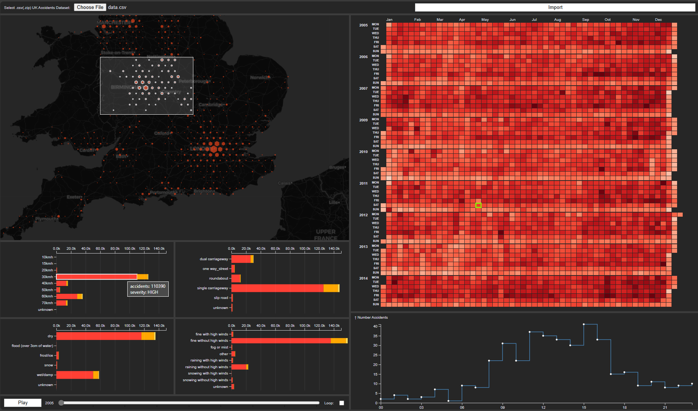

# UK Traffic Accidents Dashboard

This is an attempt at implementing a data visulization dashboard for the [UK traffic accidents dataset](https://www.kaggle.com/datasets/daveianhickey/2000-16-traffic-flow-england-scotland-wales/data).

## Usage

Open `dist/dashboard.html` file (or generate it yourself using: `npm i && npm run build`):

1. select the UK accidents dataset in `dist/data.csv` (make sure to unzip)
2. click on the import button
3. click on play to play the yearly date player
4. select a day on the calendar to showcase detailed hourly distribution of the accidents on that day

## Dataset

General dataset statistics:

- **1,504,150 entries**
- from **01/01/2005** to **31/12/2014** (NOTE: 2008 is missing)
- acquired from UK government comming from only police reports (i.e., minor incidents not included)

| Feature                                 | Type                                                                                                                                                                                                                 | Unit       |
| --------------------------------------- | -------------------------------------------------------------------------------------------------------------------------------------------------------------------------------------------------------------------- | ---------- |
| Longitude                               | float                                                                                                                                                                                                                | WGS84      |
| Latitude                                | float                                                                                                                                                                                                                | WGS84      |
| Accident_Severity                       | Categorical[1, 2, 3]                                                                                                                                                                                                 | -          |
| Number_of_Vehicles                      | integer                                                                                                                                                                                                              | -          |
| Number_of_Casualties                    | integer                                                                                                                                                                                                              | -          |
| Date                                    | datetime                                                                                                                                                                                                             | DD/MM/YYYY |
| Time                                    | integer                                                                                                                                                                                                              | HH:MM      |
| Road_Type                               | Categorical['Dual carriageway', 'One way street', 'Roundabout', 'Single carriageway', 'Slip road', 'Unknown']                                                                                                        | -          |
| Speed_limit                             | Categorical[10, 15, 20, 30, 40, 50, 60, 70]                                                                                                                                                                          | mph        |
| Junction_Control                        | Categorical['Authorised person', 'Automatic traffic signal', 'Giveway or uncontrolled', 'Stop Sign']                                                                                                                 | -          |
| Pedestrian_Crossing-Physical_Facilities | Categorical['Central refuge', 'Footbridge or subway', 'No physical crossing within 50 meters', 'Pedestrian phase at traffic signal junction', 'Zebra crossing', 'non-junction pedestrian crossing']                  | -          |
| Light_Conditions                        | Categorical['Darkeness: No street lighting', 'Darkness: Street lighting unknown', 'Darkness: Street lights present and lit', 'Darkness: Street lights present but unlit', 'Daylight: Street light present']          | -          |
| Weather_Conditions                      | Catergorical['Fine with high winds', 'Fine without high winds', 'Fog or mist', 'Other', 'Raining with high winds', 'Raining without high winds', 'Snowing with high winds', 'Snowing without high winds', 'Unknown'] | -          |
| Road_Surface_Conditions                 | Categorical['Dry', 'Flood (Over 3cm of water)', 'Frost/Ice', 'Snow', 'Wet/Damp']                                                                                                                                     | -          |
| Special_Conditions_at_Site              | Categorical['Auto traffic signal partly defective', 'Auto traffic singal out', 'Mud', 'Ol or diesel', 'Permanent sign or marking defective or obscured', 'Road surface defective', 'Roadworks']                      | -          |
| Carriageway_Hazards                     | Categorical['Any animal (except a ridden horse)', 'Dislodged vehicle load in carriageway', 'Involvement with previous accident', 'Other object in carriageway', 'Pedestrian in carriageway (not injured)']           | -          |

## Visualization Charts

### Map

Visualizes the location of accidents in UK. Accidents are quantized into bins (using d3.hexbin) according to
location proximity.

The following table describes the mappings between the input data features
and the visualization channels used for this map:

| Feature(s)            | Visualization Channel |
| --------------------- | --------------------- |
| [longitude, latitude] | location              |
| *Number_of_Accidents  | hexagon/circle radius |
| Number_of_Casualties  | color intensity       |

*Number_of_Accidents is extracted from the input data and does not exist on its own as an actual provided feature.

Supported interaction techniques for this 3D map visualization:

1. Tooltips
1. Zoom-in/out
1. Draging/panning
1. Enable/disable brushing by pressing `b`
1. Brushing of accidents based on location and filtering bottom stacked chart visualizations based on the selected accidents*

*aborted due to difficulties inversing binified WGS84 data

### Stacked Bar Charts

Visualizations two categorical attributes; first one along the Y axis and second one with stacked bar charts horizontally.
These are by far the most modular visualizations and can be to any other data attributes by ease.

The following table describes the mappings between the input data features
and the visualization channels used for this visualization:

| Feature(s)              | Visualization Channel        |
| ----------------------- | ---------------------------- |
| any categorical feature | vertical grouping (Y axis)   |
| any categorical feature | horizontal grouping (X axis) |

Supported interaction techniques for this 3D map visualization:

1. Tooltips

### Calendar

Visualizes the number of accidents on a daily basis on a callendar. This could give insight into
whether accidents happen on weekends more than weekdays or if there is a seasonal tendency to the number of accidents.

| Feature(s)           | Visualization Channel |
| -------------------- | --------------------- |
| Date                 | y-axis                |
| *Number_of_Accidents | color intensity       |

*Number_of_Accidents is extracted from the input data and does not exist on its own as an actual provided feature.

Supported interaction techniques for this 3D map visualization:

1. Tooltips
2. Select a day to show a detailed per-hour distribution of the accidents for that day
   
### Hourly-Based Line Chart

Visualizes the distribution of accidents over a day on an hourly basis. This visualization is triggered by selection
of a day on the calendar visualization (see above)

| Feature(s)           | Visualization Channel |
| -------------------- | --------------------- |
| *Hour                | x-axis                |
| *Number_of_Accidents | y-axis                |

*Hour is extracted from the input data and does not exist on its own as an actual provided feature.
*Number_of_Accidents is extracted from the input data and does not exist on its own as an actual provided feature.